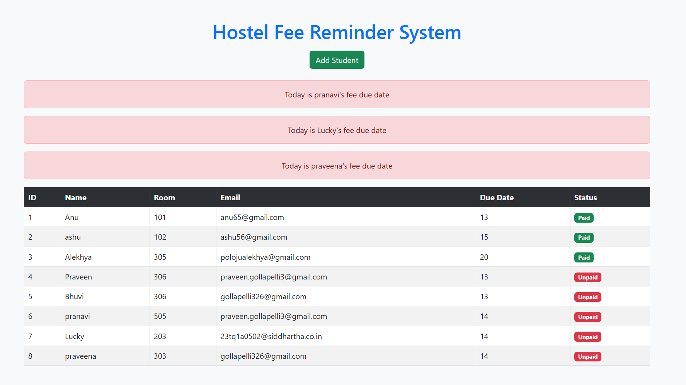
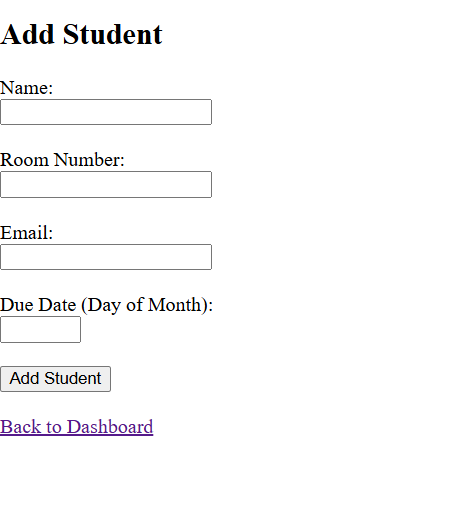

# Hostel Fee Reminder System

## Project Description

The Hostel Fee Reminder System is a web application that helps hostel owners manage student fee payments easily.

In many hostels, the owner has to manually go to each room and remind students to pay the monthly fee. This project solves that problem by sending automatic reminders to students on their due date.

The system stores student information in a database and automatically sends an email reminder when the fee due date arrives.

---

## Features

* Add hostel students
* Store student details in a database
* Display student records on a dashboard
* Send email reminders on fee due date
* Owner can track fee status (Paid / Unpaid)

---

## Technologies Used

* Python
* Flask
* SQLite
* HTML
* Bootstrap

---

## Project Structure

```
my_frst_project
│
├── p1.py
├── remainder.py
├── database.db
├── requirements.txt
├── Procfile
│
└── templates
      ├── dashboard.html
      └── add_student.html
```

---

## Installation and Setup

Follow these steps to run the project locally.

### 1. Clone the repository

```bash
git clone https://github.com/Alekhya51/hostel-fee-reminder.git
```

This command downloads the project to your computer.

---

### 2. Navigate to the project folder

```bash
cd hostel-fee-reminder
```

This command moves into the project directory.

---

### 3. Install required libraries

```bash
pip install -r requirements.txt
```

This installs required libraries such as Flask.

---

### 4. Run the application

```bash
python p1.py
```

This starts the Flask server.

---

### 5. Open the website

Open your browser and go to:

```
http://127.0.0.1:5000
```

Now the Hostel Fee Reminder System dashboard will appear.

---

## How the Reminder System Works

1. The hostel owner adds student details through the website.
2. The student data is stored in the SQLite database.
3. The `remainder.py` script checks every day for students whose due date is today.
4. If the due date matches today's date, the system sends an email reminder to the student.
5. The owner can see all students and their fee status on the dashboard.

---

## Future Improvements

* Automatic fee status update
* SMS reminders
* Online payment integration
* Admin login system
* Better dashboard UI
## Project Screenshots

### Dashboard



### Add Student Page



